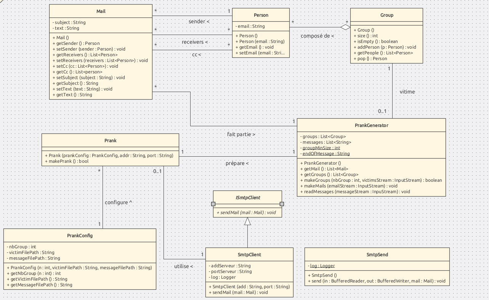
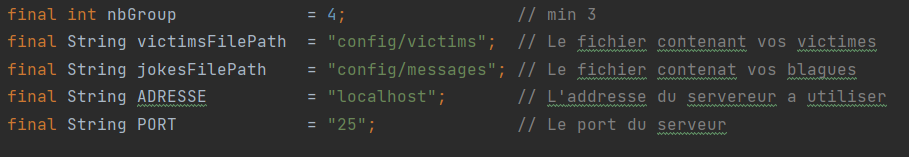

Laboratoire SMTP : De Bleser Dimitri, Peer Vincent
## Introduction

Ce projet a pour but de nous familiariser avec le protocole SMTP en envoyant 
des emails contenant des plaisanteries. 

## Présentation du projet

#### Package model
Ce package contient 2 sous packages qui sont le mail et le prank, leur union permet
de construire un mail complet, contenant une plaisanterie.
##### Package mail
La classe Person représente simplement une personne. 
Pour ce projet, nous utilisons uniquement l'adresse mail comme attribut, en effet dans un mail
les noms et prénoms peuvent ne pas être forcément nécessaire et nous  nous sommes contentés du
contenu principal.

La Classe Group représente une liste de Person, elle est munie de quelques méthodes de base
qui permettent de connaître la taille d'un groupe, d'ajouter ou retirer 
une personne, de vérifier si un groupe est vide ou non, et d'autres encore.
Cette classe sera particulièrement utile pour crée les groupes formant un mail, à 
savoir l'émetteur et les récepteurs.

La classe Mail possède tous les attributs nécesssaire pour créer un mail dans sa totalité. 
pour chacun de ces attributs, il existe un getteur et un setteur pour pouvoir accéder ou modifier
les information du mail.

#### Package prank
La classe PrankConfig stocke les informations qui permettent la création de mail en spécifiant
les noms de fichier à lire pour les listes d'email et de plaisantries. Le nombre de groupe
est égalmenet stocké ici. Des setteur/getteur sont disponibles pour configurer ce type 
d'information.

La classe PrankGenerator met en oeuvre tout l'algorithme qui génère un mail.
Il crée également les groupes de personnes qui feront parties d'un prank.
Les premières étapes de cette classe consistent à lire les fichiers et en retirer les 
emails, les prank qui seront envoyés ainsi que le nombre de groupes
demandé. Chaque mail se voit attribué 
un message qui a été lu dans un fichier également.

La Classe Prank utilise PrankGenerator afin de créer les mails qui seront prêt à l'envoie et dont 
la configuration à été tirée d'une instance de PrankConfig. Cette classe possède également une instance
de SmtpClient qui permet de lier les mails à un serveur SMTP puis finalement de pouvoir envoyer
les mails créés.

#### Package smtp
La classe SmtpClient établit une connexion avec un serveur SMTP, elle utilise une deuxième classe SmtpSend qui
a pour but d'envoyer le mail. De cette façon, la connexion serveur et l'envoie du message ainsi que le communication sont 
séparées. 
SmtpSend possède donc une fonction send qui prend en paramètre les flux d'entrées/sorties pour communiquer avec le serveur
et un mail à envoyer. C'est dans cette fonction que le protocole SMTP est utlisé pour le dialogue avec le serveur. 

### Diagram UML

## Utilisation

### Instruction pour l'utilistion de Docker
Dans le dossier docker contenant le Dockerfile et le .jar permettant
l'exécution de mockmock, effetcuer les commandes suivantes:
#### Construction de l'image 

docker build -t vincentpeer/mockmock .

#### Lancement du container

docker run -d --rm --name mockmock -p 25:25 -p 8282:8282 vincentpeer/mockmock

#### Arret du container

docker stop mockmock

Pour envoyer des blagues a vos amis, suivez les 3 etapes suivante : 
- Créé un fichier contenant la listes des adresses emails de vos victimes. Une adresse email par ligne.
- Créé un fichier contenant la liste de vos blagues à envoyer. Il est possible d'écrire sur plusieurs lignes,
mais chaque blague dois se terminer avec le mot clés "END_OF_MESSAGE".
- Modifier les variables suivantes dans la classe Main :
- 

Une fois ces étapes effectuées, exécutez le programme puis rendez-vous sur
http://localhost:8282 afin de voir le résultat qui contient les mails envoyés.

Des fichiers exemples pour les victimes et emails vous sont fournis dans le dossier config.